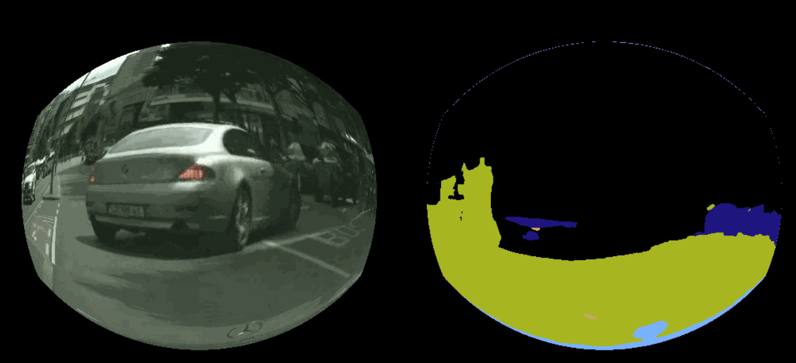

# FISHEYE-SEMANTIC-SEGMENTATION
COMPUTER VISION HOMEWORK

BEST WEIGHTS DOWNLOAD FROM: [https://pan.baidu.com/s/15_BZVLaaIhyv2DA9BLvDPQ](https://pan.baidu.com/s/15_BZVLaaIhyv2DA9BLvDPQ) EXTRACT CODE: vct8

AND MOVE IT TO `model/`

#### REQUIREMENT:

python>=3.5

pytorch>=1.4

torchvision>=0.6

opencv>=4.0

#### USAGE:

RUN `python predict.py [video path]`

#### RESULT(10 classes)

